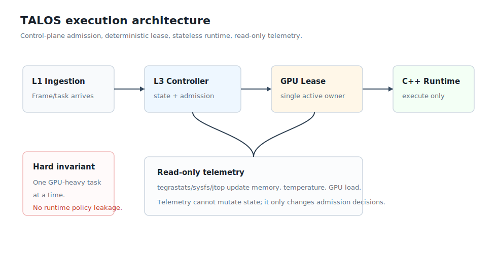

# TALOS Architecture

This document explains TALOS as an edge inference system. The target reader is a senior inference, robotics, or embedded systems engineer reviewing whether the boundaries and tradeoffs are coherent.

## System Definition

TALOS is a deterministic admission-control and execution-orchestration layer for Jetson-class AI workloads.

It is not:

- a flight stack
- a robotics middleware
- a distributed scheduler
- a training framework
- a model accuracy benchmark

It is:

- a GPU scheduling authority
- a telemetry-aware admission controller
- a thermal and memory arbitration layer
- a lease-based execution guard
- an observability layer for inference decisions

## Core Invariant

```text
Only one GPU-heavy execution may be active at a time.
```

This is enforced by `GpuLeaseManager`. Acquiring GPU execution rights returns a lease object; dropping that lease releases the resource.

This is intentionally conservative. On a small embedded device, uncontrolled concurrency can create memory spikes, latency jitter, and thermal instability. Throughput optimizations can come later; deterministic ownership is the safety baseline.

## Layered Architecture

```text
L4 Telemetry       observe only
L3 Controller      decide
L2 Runtime         execute only
L1 Ingestion       create tasks
```



Important boundaries:

- Telemetry never mutates policy state.
- Runtime never sees scheduler state or queue pressure.
- Ingestion never bypasses task metadata contracts.
- The controller is the only scheduling authority.

## Execution Flow

```text
task arrives
read telemetry
compute queue pressure
evaluate state machine
make admission decision
if admitted: acquire GPU lease
execute runtime
release lease
log observation
if deferred: enqueue
if rejected: drop with logged reason
```

The decision vocabulary is deliberately small:

```text
ADMIT  -> run now if a lease can be acquired
DEFER  -> queue for later
REJECT -> do not run under current constraints
```

This distinction matters. `DEFER` is a latency tradeoff; `REJECT` is a safety or feasibility boundary.

## Why Rust For The Control Plane

Rust owns the parts of the system where state correctness matters most:

- admission control
- queue pressure
- state machine
- GPU lease lifetime
- telemetry monitor
- structured observations
- benchmark and HITL runners

The lease model is the strongest reason for Rust. RAII makes resource release a property of object lifetime instead of a convention.

Rust enums also make the policy auditable:

```text
SchedulerState = NORMAL | HIGH_LOAD | THROTTLE | DEGRADED
DecisionStatus = ADMIT | DEFER | REJECT
TaskType = CV_FEATURES | CHANGE_DETECTION | VLM_QUERY
```

For an edge system, this is more valuable than hiding policy inside dynamic scripts or backend-specific callbacks.

## Why C++ For The Runtime

C++ owns the in-process execution boundary because production edge inference stacks are usually C++ or C-compatible:

- TensorRT
- CUDA
- OpenCV
- vendor acceleration libraries

The current C++ runtime is stateless and policy-free. It receives a buffer and returns a result. It does not know:

- temperature
- memory pressure
- queue pressure
- task priority policy
- lease state

That is deliberate. Runtime code must not quietly become a second scheduler.

## Why `cxx`

The Rust/C++ runtime boundary uses `cxx` because TALOS wants a narrow, typed, in-process contract:

```text
Rust task payload -> C++ execution -> Rust observation
```

Benefits:

- no text serialization
- typed boundary
- low-friction replacement with TensorRT/CUDA/OpenCV code
- runtime cannot own a hidden queue
- latency remains measurable from Rust

TALOS also supports external model adapters for validation work, but the production-shaped path is the in-process boundary.

## Why Python Exists

Python is not in the control loop.

Python is used for:

- SmolVLM probing
- DTU defect crop generation
- report and asset generation
- model/tool validation

This is an intentional boundary. Python is useful for model tooling; Rust owns the safety-critical admission path.

## Telemetry Model

Telemetry is read-only. TALOS supports:

- `synthetic` for SITL regression and fault injection
- `sysfs` for real temperature and memory
- `tegrastats` for Jetson GPU, power, and thermal side-channel evidence
- `jtop` as an optional Jetson telemetry path

If a real telemetry sample fails, TALOS uses the last good sample and logs `telemetry_valid=false`. A telemetry failure should be visible, but it should not automatically crash the control plane.

## Queue Pressure

Queue pressure is derived from TALOS-owned queued tasks:

```text
HIGH   = 10
MEDIUM = 5
LOW    = 1
```

This is not hardware telemetry. It is logical backlog pressure. Keeping it separate from physical telemetry makes the system easier to review.

## VLM Gating

VLM is treated as useful but deferrable. TALOS can defer or reject VLM based on:

- input too large
- hard memory pressure
- soft memory pressure
- thermal VLM gate
- high-load state
- throttle/degraded state
- active CV burst
- active GPU lease

The policy goal:

```text
protect critical perception
postpone semantic/operator queries
recover VLM work when resources return
```

The latest HITL recovery run proves this loop:

```text
unique_tasks=240
vlm_deferred=36
vlm_replayed=36/36
rejected=0
peak_temperature_c=51.312
```

## Observability

Every decision or execution is written as JSONL. CSV is optional.

Important fields:

- task id
- task type
- decision
- queue pressure
- scheduler state
- telemetry source
- telemetry validity
- temperature
- memory usage
- GPU utilization
- lease id
- latency
- execution time
- VLM gate reason
- real model backend metadata

This is not cosmetic. It is how the project proves what happened under pressure.

## SITL vs HITL

TALOS keeps simulation-in-the-loop and hardware-in-the-loop separate.

SITL proves deterministic policy behavior:

- injected thermal spikes
- injected memory pressure
- repeatable contention
- regression testing

HITL proves hardware integration:

- real Orin Nano telemetry
- real power and thermal side-channel logs
- real CUDA/PyTorch/TensorRT probes
- real defer and replay behavior

Mixing those casually would pollute evidence. The split is intentional.

## Design Tradeoffs

| Decision | Benefit | Cost |
| --- | --- | --- |
| Rust control plane | ownership, explicit states, testability | less direct ML ecosystem access |
| C++ runtime | TensorRT/CUDA/OpenCV alignment | requires FFI discipline |
| `cxx` bridge | typed in-process boundary | less flexible than plugins |
| external model adapter | validates real tools quickly | subprocess overhead |
| single GPU lease | deterministic resource ownership | lower peak throughput |
| JSONL-first logging | auditable evidence | verbose output |
| SITL/HITL split | clean evidence model | more commands |
| VLM defer policy | protects critical perception | VLM answers may arrive late |

## What A Senior Engineer Should Look For

The important signal is not raw model accuracy. The important signal is systems judgement:

- clear control/data-plane separation
- explicit resource ownership
- deterministic admission decisions
- bounded runtime authority
- real telemetry integration
- honest SITL/HITL separation
- recovery after graceful degradation

## Current Limitations

TALOS should not claim more than it proves.

Current limitations:

- It is not a complete autonomy stack.
- The C++ CV runtime is mission-like feature extraction, not a trained detector.
- SmolVLM quality depends on the chosen model and prompt.
- CUDA burn is a stress helper, not a mission workload.
- External backend adapters are validation paths, not final hard real-time infrastructure.

The defensible claim is:

```text
TALOS is a mature inference orchestration and resource arbitration prototype with real Jetson HITL evidence.
```

## Next Engineering Steps

Highest-value next steps:

1. Move a real TensorRT engine behind the in-process C++ runtime.
2. Replace deterministic CV features with a real vision model.
3. Connect VLM defer/replay policy directly to the SmolVLM DTU defect pipeline.
4. Add thermal hysteresis to reduce threshold chatter.
5. Add bounded queue aging and task deadlines.
6. Add latency SLO reporting per task class.
7. Add power-mode metadata to every HITL run.
