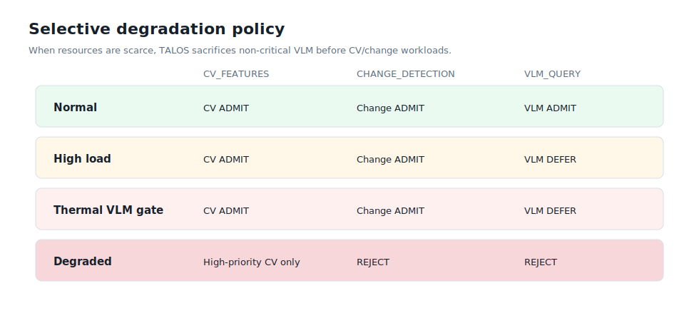
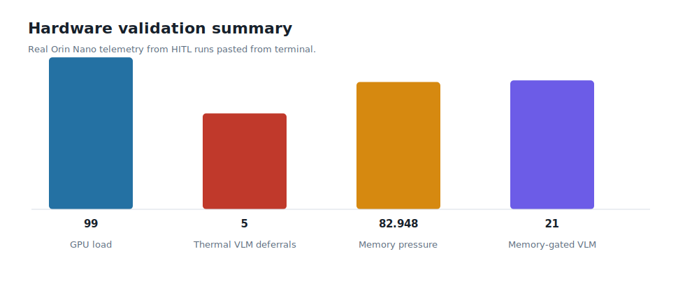
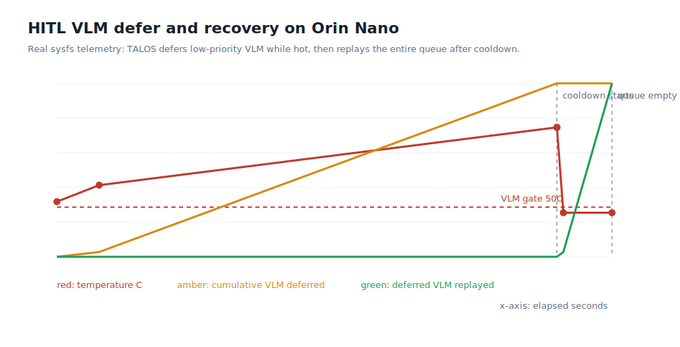

# TALOS

TALOS is an edge-AI orchestration framework in Rust/C++ for NVIDIA Jetson-class systems with deterministic admission control, GPU lease management, and hardware-in-the-loop telemetry validation.


## System Capabilities

| Area | Implementation |
| --- | --- |
| Control plane | Rust admission policy, queue pressure, scheduler state, telemetry validation, observability |
| Data plane | C++20 runtime boundary behind a typed `cxx` bridge |
| Resource control | RAII GPU leases with one active GPU-heavy execution at a time |
| Telemetry | Linux `sysfs`, Jetson `tegrastats`, optional `jtop`, and synthetic SITL telemetry |
| Workloads | CV features, change detection, VLM queries, TensorRT/ONNX adapter paths |
| Validation | SITL regression runs and Jetson hardware-in-the-loop thermal/resource workloads |
| Output | JSONL/CSV event logs, generated metrics reports, SVG summaries |

## Admission Model

TALOS evaluates telemetry, memory state, queue pressure, scheduler state, task type, and active GPU leases before runtime execution.



The scheduler emits three decision states:

```text
ADMIT  -> execute immediately if a GPU lease is available
DEFER  -> retain work for replay after resource recovery
REJECT -> terminate scheduling for the task under current constraints
```

## Hardware-In-The-Loop Evidence

The Jetson HITL runs exercise the control plane against real device telemetry and stress workloads.



VLM workloads can be deferred while thermal gates are active, then replayed after cooldown.

<!--  -->



Latest generated metrics are available in:

- [`docs/metrics_report.md`](docs/metrics_report.md)
- [`docs/metrics_summary.json`](docs/metrics_summary.json)

## Repository Layout

```text
core/          Rust control plane: admission, scheduler, telemetry, leases
runtime/       C++ runtime implementation
ipc/           cxx bridge declaration
edge_node/     edge demo runner
hitl/          hardware-in-the-loop runner
evaluation/    simulation-in-the-loop benchmarks
deployment/    Jetson hardening helper
scripts/       sync, reporting, model probes, dataset tools
docs/          architecture notes, generated metrics, visual assets
tools/         low-level stress helpers
```

## Build And Validate

Run the local test suite:

```bash
make test
```

Regenerate reports and visual assets:

```bash
make report
```

Run deterministic SITL benchmarks:

```bash
make bench-phase6
make bench-phase8
```

Run the standard Jetson validation sequence:

```bash
make jetson-update
```

Run VLM thermal defer and replay on Jetson:

```bash
make jetson-run-vlm-defer-recovery VLM_DEFER_TEMP_C=50
```

## Documentation

- [`docs/README.md`](docs/README.md): architecture, Rust/C++ bridge, telemetry model, memory ownership, and validation boundaries.
- [`docs/real_model_backends.md`](docs/real_model_backends.md): TensorRT, ONNX, and SmolVLM adapter paths.
- [`docs/metrics_report.md`](docs/metrics_report.md): generated report from recorded run evidence.
